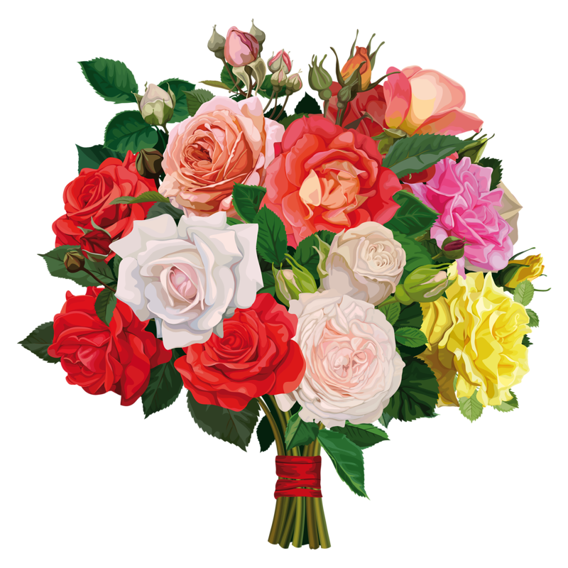

# floricultura
repositório/floricultura
<html lang pt-br>
<title>Floricultura</title>
<h1>Minhas impressões</h1>

     

            <h1>Principais pontos</h1> 
            

                <h2>Objetivos</h2>
                O site tem como principal objetivo ser um portal de venda de flores.
                O site apresenta um design funcional simples e útil
                the Recruitment drive  of product based
                companies like Microsoft, Amazon, Adobe
                etc with a free online placement preparation
                course.
            
            
            

                <h2>Pontos positivos</h2>
                The course focuses on various MCQ's & Coding
                question likely to be asked in the interviews
                & make your upcoming placement season efficient
                and successful.
            
    
            

                <h2>Pontos Negativos</h2>
                O site apresenta cores 
                articles on the GeeksforGeeks, publishing
                articles follow few steps that are Articles
                that need little modification/improvement
                from reviewers are published first.
            

        

<html>
